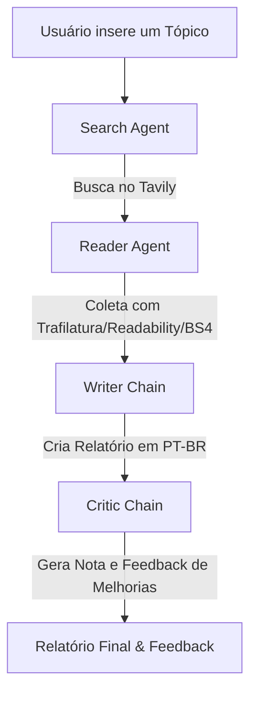

# LangChain-Multi-Agent-Research-System
Multiagente Langchain do curso Bappy

## 🚀 Sobre o Projeto (Open Source)
Este é um sistema multiagente inteligente e colaborativo desenvolvido em Python usando o ecossistema LangChain. O projeto foi estruturado para realizar pesquisas automatizadas, coletar e analisar artigos da internet, redigir relatórios detalhados e revisar a qualidade do material gerado por meio de agentes especializados.

---

## 🛠️ Tecnologias Utilizadas

- **LangChain / LangChain OpenAI:** Framework base para a construção dos agentes autônomos e execução do modelo `gpt-4o-mini` da OpenAI.
- **Tavily Search API:** API especializada para buscas rápidas e filtradas na web.
- **Streamlit:** Interface web moderna e responsiva com acompanhamento do progresso das etapas em tempo real.
- **Ferramentas de Web Scraping:**
  - `trafilatura` (extração limpa e estruturada de artigos).
  - `readability-lxml` (fallback baseado em relevância de conteúdo textual).
  - `beautifulsoup4` (fallback básico para páginas HTML gerais).
- **python-dotenv:** Gerenciamento seguro de variáveis de ambiente.
- **Rich:** Visualização rica e formatada de logs no terminal.

---

## 📐 Arquitetura do Sistema

O sistema é dividido em quatro componentes principais organizados de forma sequencial (Pipeline):



1. **Search Agent (`src/agents/agents.py`):** Utiliza a ferramenta `web_search` para buscar na web conteúdos relevantes e recentes sobre o tópico informado pelo usuário.
2. **Reader Agent (`src/agents/agents.py`):** Analisa as URLs retornadas pela busca, escolhe a mais relevante e executa a extração do conteúdo completo com o `scrape_url`.
3. **Writer Chain:** Compila as descobertas da busca e do artigo raspado para redigir um relatório de pesquisa detalhado estruturado em Markdown e escrito em Português do Brasil (PT-BR).
4. **Critic Chain:** Atua como um revisor crítico, avaliando o relatório gerado de forma estrita, atribuindo uma nota de 0 a 10, listando pontos fortes e pontos a melhorar em português.

---

## 📦 Como Instalar e Executar

Siga os passos abaixo para clonar, configurar e rodar o projeto localmente:

### 1. Criar e ativar o ambiente virtual

```bash
python3 -m venv venv
source venv/bin/activate # activate my_env
pip install --upgrade pip
```

### 2. Instalar as dependências

```bash
pip install -r requirements.txt
```

### 3. Configurar as credenciais
Crie um arquivo `.env` na raiz do projeto com as suas chaves de API:
```env
OPENAI_API_KEY="sua_chave_openai_aqui"
TAVILY_API_KEY="sua_chave_tavily_aqui"
```

### 4. Executar o Projeto

#### Via Interface Web (Streamlit):
Para iniciar a interface interativa rodando localmente no navegador:
```bash
python3 run app.py
```

#### Via Linha de Comando (CLI):
Para rodar a pesquisa direto pelo terminal:
```bash
python3 main.py
```

---

## 📁 Estrutura de Pastas

```
LangChain-Multi-Agent-Research-System/
├── venv/
├── src/
│   ├── __init__.py
│   ├── agents/
│   ├── pipelines/
│   └── tools/
├── .env
├── .gitignore
├── app.py
├── LICENSE
├── main.py
├── README.md
└── requirements.txt
```